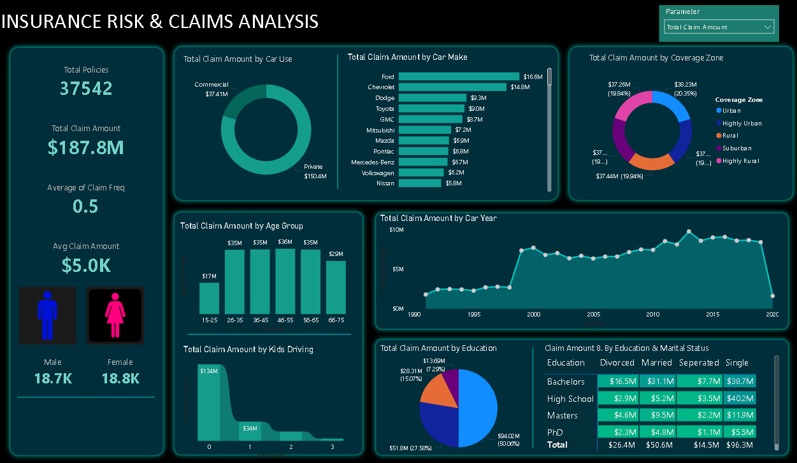

# Insurance Risk & Claims Analysis

## 📊 Project Overview

An interactive Power BI dashboard developed to help an insurance company
understand its policyholder base, claim patterns, and potential risk factors.

## 🎯 Business Objectives

- Monitor total policies and claim amounts
- Analyse claim frequency and average claim severity
- Identify customer segments and potential risk patterns
- Analyse claims across vehicle, geographic and demographic factors

## 📈 Key KPIs

- Total Policies: 37.5K
- Total Claim Amount: $187.8M
- Average Claim Frequency: 0.5
- Average Claim Amount: $5.0K

## 📊 Dashboard Preview

## 🔍 Analysis Performed

The dashboard analyses insurance claims across:

- Car Use
- Car Make
- Coverage Zone
- Age Group
- Car Year
- Kids Driving
- Education
- Education & Marital Status

## 🛠️ Tools & Technologies

- Power BI
- DAX
- Power Query
- Data Analysis
- Data Visualization

## 📁 Project Files

- `Insurance_Risk_Claims_Analysis.pbix` — Power BI dashboard
- `Dashboard.png` — Dashboard preview

## 📂 Dataset

The dashboard was developed using an insurance policy and claims dataset.

The dataset contains information related to policyholders, vehicles,
coverage zones, demographics and claim amounts.

